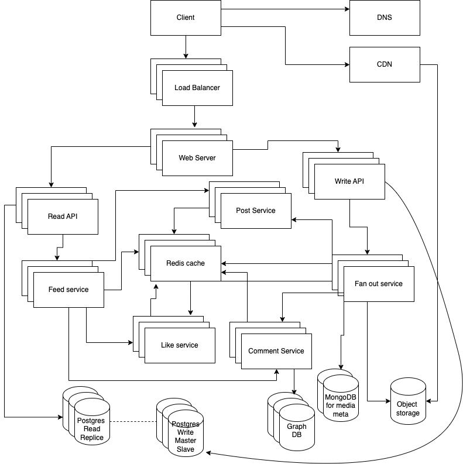

## Design Instagram Photos, Videos, Comments, and Likes

### Step 1: Outline use cases and constraints

#### Use cases
- Users can upload photos or videos
- Users can write comments on photos or videos
- Users can 'like' photos or videos
- Service should be highly available

#### Constraints and assumptions

##### General
- Read-heavy
- High availability is desirable
- Users can upload photos or videos
- Photos and videos can be of different sizes
- Users can have millions of followers
- Feed consist of photos and videos posted by the user and the users they follow
- Monthly active users 2 B
- Estimated daily posts (photos and videos) 100 M

#### Calculate usage

##### Storage estimates
- Assume 500 million daily photos
- Assume 100 million daily videos
- Assume each photo is 2MB
- Assume each video is 100 MB
- Total storage per day
    - Photos: 500M * 2MB = 1PB
    - Videos: 100M * 100MB = 10PB
    - Total: 11PB per day

- Size per post:
  - user_id - 32 bytes
  - post_id - 32 bytes
  - text - 2200 bytes (UTF-8, maximum 2200 characters Instagram requirements)
  - media - 40kb average
  - Total size per post: 40kb + 32b + 32b + 2200b = 42,26kb
 - Size per post in Feed:
   - post_id - 32 bytes
   - user_id - 32 bytes
   - Total size per post in Feed: 64 bytes

##### Traffic estimates
- Write: 1M new photos uploaded per minute
- Write: 20K new videos uploaded per minute
- Read: 1M photo/video requests per minute

### Step 2: Create a high-level design

### Step 3: Design core components

#### Use case: Users make a post
When a user posts a photo or video, we need to store the post in our database and display it on the user's feed.
- The Client make request for creating a post to the Load Balancer.
- Load Balancer forwards the request to the Web Server, running as a reverse proxy.
- Web Server forwards the request to the Write API.
- Write API store the post in the Postgres Database.
- Write API call the Fanout Service to update the feed of all followers in the Redis Database.
  - Fanout Service call the Post service to store post_id, user_id, text, media_ids to the Redis Database.
  - Fanout Service store post_id, user_id to the Redis Database for each follower`s feed.
  - Fanout Service store media in the S3 Bucket.
  - Fanout Service store media meta info in the MongoDB.
  - Fanout Service store meta_id, media_id, post_id info in the Redis Database.

#### Use case: Users see a feed
When a user opens their feed, we need to display the latest posts from all the users they follow.
- The Client make request for the feed to the Load Balancer.
- Load Balancer forwards the request to the Web Server, running as a reverse proxy.
- Web Server forwards the request to the Read API.
- Read API make a request to the Feed Service to get the feed of the user.
  - Feed Service get feed info post_id, user_id from Redis cache
  - Feed Service get post info post_id, text, media_ids from Post Service
  - Feed Service get likes info post_id, like_id, user_id from Like Service
  - Feed Service get comments info post_id, comment_id, user_id, text from Redis Cache

#### Use case: Users like a post
When a user likes a post, we need to store this information in our database.
- The Client make request for liking a post to the Load Balancer.
- Load Balancer forwards the request to the Web Server, running as a reverse proxy.
- Web Server forwards the request to the Write API.
- Write API store the like in the Postgres Database.
- Write API call the Fanout Service to update the feed of all followers in the Redis Database.
  - Fanout service call the Like service to store like_id, post_id, user_id to the Redis Database.

#### Use case: Users comment on a post
When a user comments on a post, we need to store this information in our database.
- The Client make request for commenting on a post to the Load Balancer.
- Load Balancer forwards the request to the Web Server, running as a reverse proxy.
- Web Server forwards the request to the Write API.
- Write API store the comment in the Postgres Database.
- Write API call the Fanout Service to update the feed of all followers in the Redis Database.
  - Fanout service call the Comment service to store comment_id, post_id, user_id, text to the Redis Database.
  - Comment Service build graph of comments and store in the MongoDB.
  - Comment Service store comment_id, post_id, user_id, text to the Redis Database.

### Step 4: Bottlenecks and optimizations
Fanout and Feed Service can be bottlenecks. We can optimize them by using caching and sharding.
